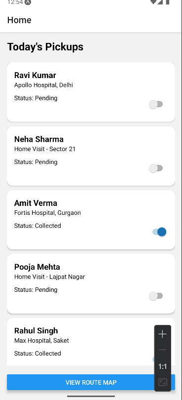
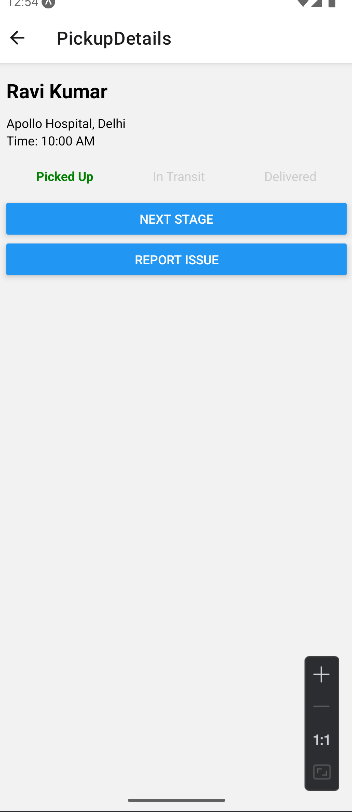
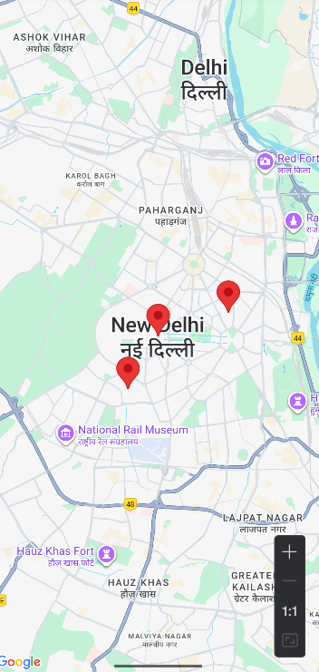

# Sample Collection Agent App

## 📌 Overview

This is a **React Native mobile app** made for medical agents who **collect diagnostic samples** from hospitals, clinics, and patient homes. The goal is to make their work easier, faster, and error-free – even when there is low internet connectivity.

---

## 👷‍♂️ How an Agent Uses the App

1. **Opens the App**
2. Sees a list of all pickups for today
3. Taps a patient to view details
4. Marks the sample as "Collected", "In Transit", or "Delivered"
5. Can report an issue if something goes wrong (e.g. patient not available)
6. Can view pickup locations on the map to plan the route

---

## 🧭 App Workflow

### 1. Home Screen
- Lists all pickups for the day
- Each pickup card has name, location, and collection status
- Tap a card to go to details

### 2. Pickup Details Screen
- Shows full details: name, address, time, contact
- Sample status update (e.g. Collected → In Transit)
- Report an issue if needed
- Button to open Route Map

### 3. Route Map Screen
- Map showing locations of all pickups
- Helps agent plan their travel route

### 4. Report Issue Screen
- Simple text input to describe the issue
- (Can be expanded later with photo upload, categories, etc.)

---

## 🧠 Why This App is Useful

- ✅ Easy to use even by non-tech-savvy agents
- ✅ Works in low internet areas (can be made offline-first)
- ✅ Reduces manual errors and paperwork
- ✅ Keeps hospitals updated in real time
- ✅ Saves time with route planning

---

## 🖼️ Screenshots

### Home Screen

### Pickup Details Screen

### Route Map Screen

### Report Issue Screen

---

## 🗂️ Folder Structure

